# Generator & UploadZone Components — UGC Short Video Ads Generator

> This document explains the implementation of the `Generator` page and reusable `UploadZone` component used in the UGC Short Video Ads Generator.

The focus is on the actual project implementation:

- Form state management
- Controlled inputs
- Image/file handling
- Reusable upload components
- TypeScript event types
- Aspect-ratio selection
- Conditional rendering
- Image previews
- Form submission
- Generation loading state
- How this frontend will connect with the backend

---

# 1. Purpose of the Generator Page

The `Generator` page is the main interface where the user provides all the information required to generate UGC content.

The user can provide:

- Project name
- Product name
- Product description
- Product image
- Model image
- Aspect ratio
- Custom AI prompt

The current frontend collects this information and stores it in React state.

Later, this data will be sent to the backend, where the actual AI generation pipeline will run.

---

# 2. Generator Component Architecture

The page is divided into three major sections:

1. Page heading
2. Generation inputs
3. Generate button

The generation inputs themselves contain image uploads and text/configuration inputs.

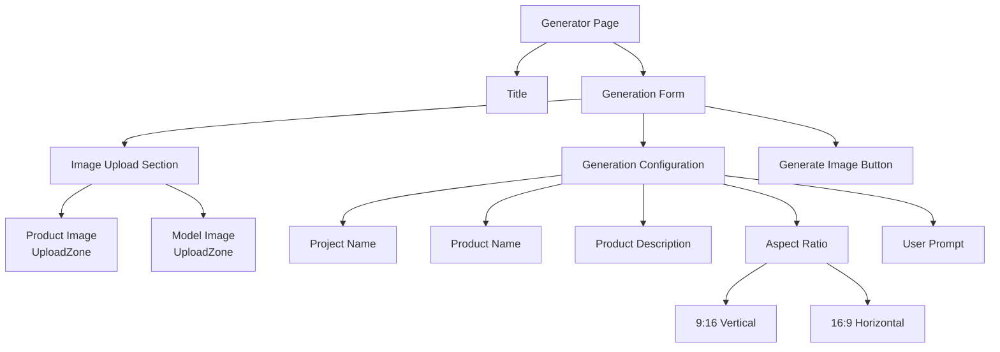

---

# 3. Imports

The component imports:

```tsx
import React, { useState } from "react";

import Title from "../components/Title";

import UploadZone from "../components/UploadZone";

import {
  Loader2Icon,
  RectangleHorizontalIcon,
  RectangleVerticalIcon,
  Wand2Icon
} from "lucide-react";

import {
  PrimaryButton
} from "../components/Buttons";
```

Each import has a specific responsibility.

| Import | Purpose |
|---|---|
| `React` | Provides React event types used in TypeScript |
| `useState` | Stores form and generation state |
| `Title` | Reusable page heading component |
| `UploadZone` | Reusable image-upload component |
| `Loader2Icon` | Loading animation during generation |
| `RectangleVerticalIcon` | Represents 9:16 aspect ratio |
| `RectangleHorizontalIcon` | Represents 16:9 aspect ratio |
| `Wand2Icon` | Generate button icon |
| `PrimaryButton` | Reusable primary button |

---

# 4. Generator State

The component maintains the following state:

```tsx
const [name, setName] = useState("");

const [productName, setProductName] =
  useState("");

const [
  productDescription,
  setProductDescription
] = useState("");

const [aspectRatio, setAspectRatio] =
  useState("9:16");

const [productImage, setProductImage] =
  useState<File | null>(null);

const [modelImage, setModelImage] =
  useState<File | null>(null);

const [userPrompt, setUserPrompt] =
  useState("");

const [isGenerating, setIsGenerating] =
  useState(false);
```

The state structure can be visualized as:

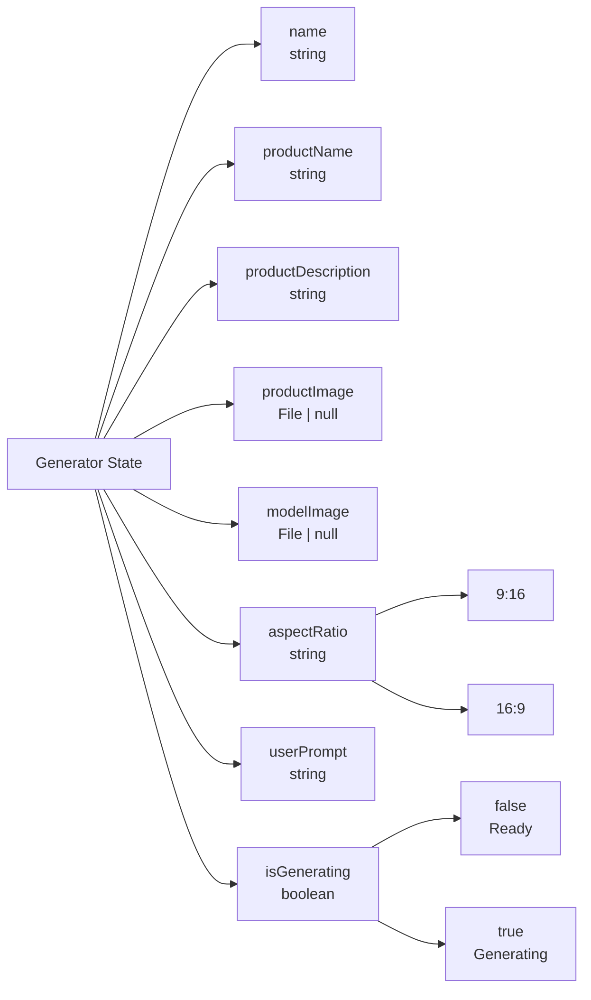

These values together represent the data required to create a generation request.

---

# 5. Project Name

The project name is stored using:

```tsx
const [name, setName] = useState("");
```

The corresponding input is:

```tsx
<input
  type="text"
  id="name"
  value={name}
  onChange={(e) =>
    setName(e.target.value)
  }
  placeholder="Name your project"
  required
/>
```

The important properties are:

```tsx
value={name}
```

and:

```tsx
onChange={(e) =>
  setName(e.target.value)
}
```

When the user types:

```text
Summer Watch Campaign
```

the flow is:

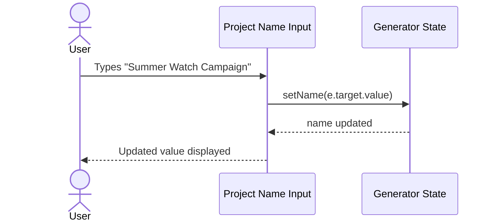

The React state therefore remains synchronized with the input.

---

# 6. Product Name

The product name is stored using:

```tsx
const [productName, setProductName] =
  useState("");
```

Input:

```tsx
<input
  type="text"
  id="productName"
  value={productName}
  onChange={(e) =>
    setProductName(e.target.value)
  }
  placeholder="Enter the name of the product"
  required
/>
```

Example:

```text
productName = "Nova Smart Watch"
```

This value later gives the AI generation pipeline explicit information about the product being advertised.

---

# 7. Product Description

The product description is optional.

State:

```tsx
const [
  productDescription,
  setProductDescription
] = useState("");
```

Textarea:

```tsx
<textarea
  id="productDescription"
  rows={4}
  value={productDescription}
  onChange={(e) =>
    setProductDescription(e.target.value)
  }
  placeholder="Enter the description of the product"
/>
```

Example:

```text
Nova Smart Watch with AMOLED display,
health tracking, GPS and seven-day
battery life.
```

The product description provides additional context that can later be passed to the AI model.

---

# 8. User Prompt

The user can also provide custom generation instructions.

State:

```tsx
const [userPrompt, setUserPrompt] =
  useState("");
```

Textarea:

```tsx
<textarea
  id="userPrompt"
  rows={4}
  value={userPrompt}
  onChange={(e) =>
    setUserPrompt(e.target.value)
  }
  placeholder="Describe how you want the narration to be."
/>
```

Example:

```text
Create an energetic social-media style
advertisement. Make the model introduce
the product naturally.
```

This gives the user additional control over the generated content.

Eventually, the AI generation context may contain information such as:

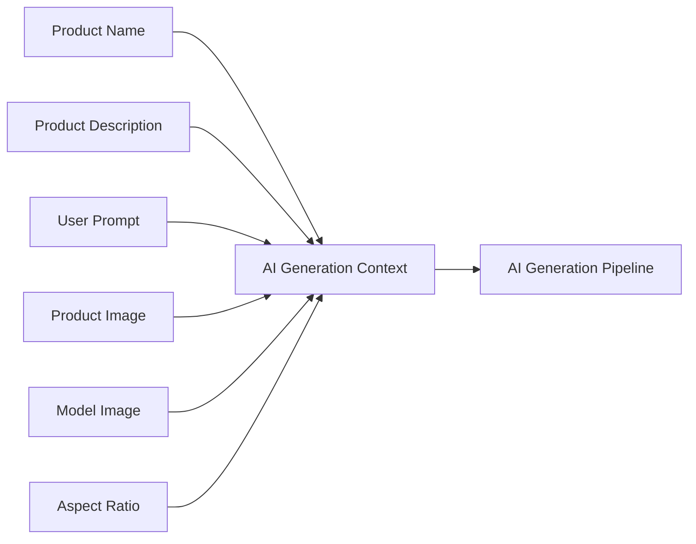

---

# 9. Aspect Ratio Selection

The application currently allows two aspect ratios:

```text
9:16
16:9
```

State:

```tsx
const [aspectRatio, setAspectRatio] =
  useState("9:16");
```

The default value is:

```text
9:16
```

---

## 9.1 Vertical 9:16

The vertical option uses:

```tsx
<RectangleVerticalIcon
  onClick={() =>
    setAspectRatio("9:16")
  }
/>
```

This format is suitable for short-form vertical content such as:

- Instagram Reels
- YouTube Shorts
- TikTok-style videos
- Mobile-first UGC ads

---

## 9.2 Horizontal 16:9

The horizontal option uses:

```tsx
<RectangleHorizontalIcon
  onClick={() =>
    setAspectRatio("16:9")
  }
/>
```

This format is suitable for horizontal content.

The selection flow is:

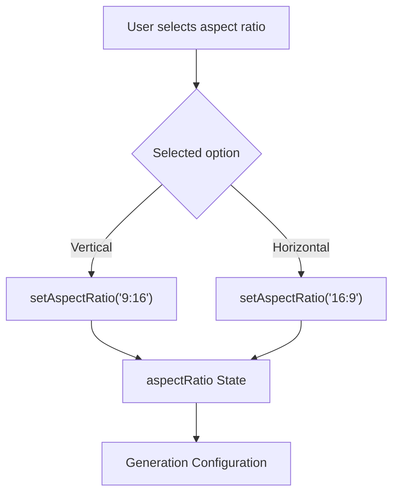

---

# 10. Showing the Selected Aspect Ratio

The selected icon receives additional Tailwind styling.

For example:

```tsx
className={`
  p-2.5
  size-13
  bg-white/6
  rounded
  transition-all
  ring-2
  ring-transparent
  cursor-pointer

  ${
    aspectRatio === "9:16"
      ? "ring-violet-500/50 bg-white/10"
      : ""
  }
`}
```

The important condition is:

```tsx
aspectRatio === "9:16"
```

When it evaluates to `true`, these classes are added:

```tsx
ring-violet-500/50
bg-white/10
```

The same logic is used for `16:9`.

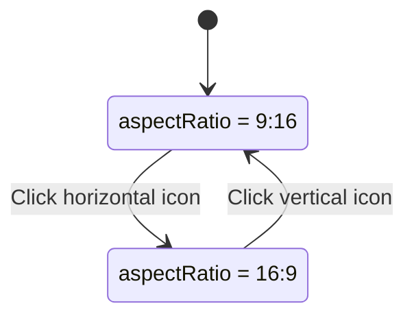

The state therefore controls both:

- The value that will eventually be sent to the backend
- Which option appears selected in the UI

---

# 11. Image State

Two image files are currently supported:

```tsx
const [productImage, setProductImage] =
  useState<File | null>(null);

const [modelImage, setModelImage] =
  useState<File | null>(null);
```

The type is:

```tsx
File | null
```

Initially:

```text
productImage = null
modelImage   = null
```

After selection:

```text
productImage = File
modelImage   = File
```

A browser `File` object contains information such as:

```text
File
├── name
├── size
├── type
└── lastModified
```

For example:

```text
name: product.png
type: image/png
size: 245 KB
```

---

# 12. Why `File | null` Is Used

A file does not exist when the page first loads.

Therefore this would not correctly represent the initial state:

```tsx
useState<File>()
```

Instead:

```tsx
useState<File | null>(null)
```

expresses both possible situations:

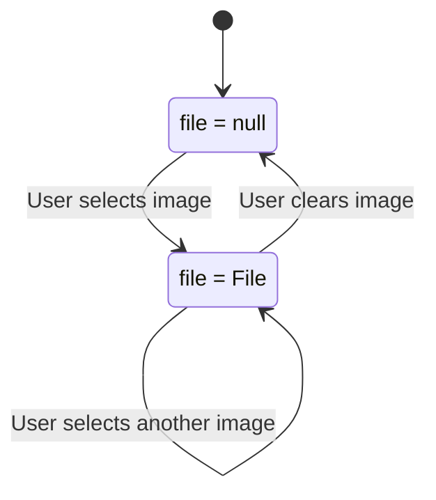

---

# 13. `handleFileChange()`

Both image uploaders use the same handler:

```tsx
const handleFileChange = (
  e: React.ChangeEvent<HTMLInputElement>,
  type: "product" | "model"
) => {

  if (
    e.target.files &&
    e.target.files[0]
  ) {

    if (type === "product")
      setProductImage(e.target.files[0]);

    else
      setModelImage(e.target.files[0]);
  }
};
```

Instead of creating:

```tsx
handleProductImage()
handleModelImage()
```

we reuse one function and tell it which image is being changed.

---

# 14. Understanding the Parameters

The function receives:

```tsx
e: React.ChangeEvent<HTMLInputElement>
```

and:

```tsx
type: "product" | "model"
```

The first parameter represents the file-input change event.

The second tells the function which state should be updated.

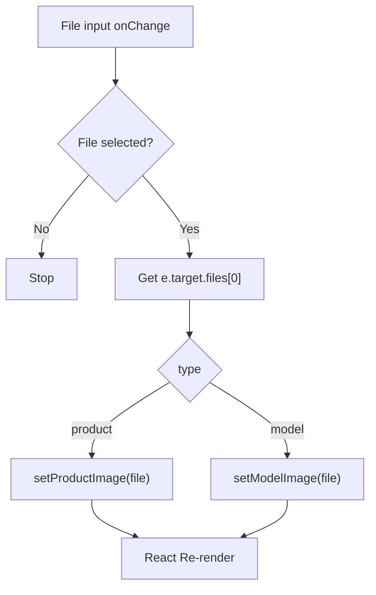

---

# 15. TypeScript Event Type

The event is typed as:

```tsx
React.ChangeEvent<HTMLInputElement>
```

This tells TypeScript that the event came from an HTML input.

Because of this, TypeScript correctly understands:

```tsx
e.target
```

and:

```tsx
e.target.files
```

This also gives proper editor autocomplete and type checking.

---

# 16. Union Type for Image Category

The second parameter uses:

```tsx
type: "product" | "model"
```

This is a TypeScript union.

Only these two values are accepted:

```tsx
"product"
```

or:

```tsx
"model"
```

Valid:

```tsx
handleFileChange(e, "product");
```

Valid:

```tsx
handleFileChange(e, "model");
```

Invalid:

```tsx
handleFileChange(e, "profile");
```

TypeScript would reject the last example because `"profile"` is not part of the allowed union.

---

# 17. Understanding `e.target.files`

For:

```tsx
<input type="file" />
```

selected files are available through:

```tsx
e.target.files
```

The code checks:

```tsx
if (
  e.target.files &&
  e.target.files[0]
)
```

This ensures that a file was actually selected.

Then:

```tsx
e.target.files[0]
```

retrieves the first selected file.

Since the current input only needs one image, index `0` is sufficient.

---

# 18. Product Image Upload

The first reusable uploader is:

```tsx
<UploadZone
  label="Product Image"
  file={productImage}
  onClear={() =>
    setProductImage(null)
  }
  onChange={(e) =>
    handleFileChange(e, "product")
  }
/>
```

The component receives:

```text
label
file
onClear
onChange
```

The complete upload flow is:

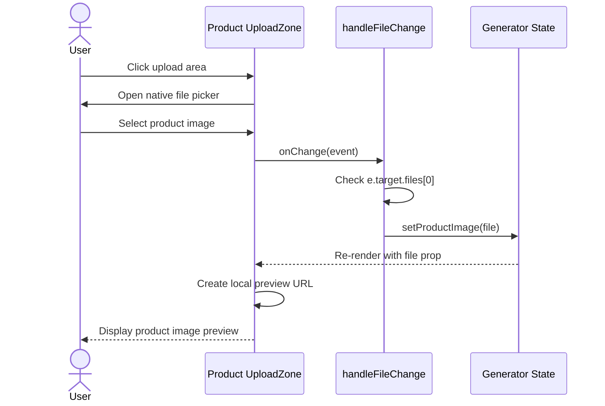

---

# 19. Model Image Upload

The second uploader uses exactly the same reusable component:

```tsx
<UploadZone
  label="Model Image"
  file={modelImage}
  onClear={() =>
    setModelImage(null)
  }
  onChange={(e) =>
    handleFileChange(e, "model")
  }
/>
```

The difference is:

```tsx
handleFileChange(e, "model")
```

which results in:

```tsx
setModelImage(e.target.files[0]);
```

Therefore one component handles two different image inputs.

---

# 20. Why `UploadZone` Is Reusable

Both upload interfaces need exactly the same functionality:

- Click to upload
- File picker
- Image preview
- Filename
- Remove button
- Hover effects
- Drag-and-drop style UI

Only the following values change:

```text
Label
File
Change Handler
Clear Handler
```

Therefore these differences are passed as props.

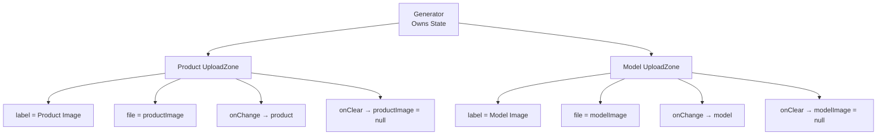

This prevents duplicated upload code.

---

# 21. `UploadZoneProps`

The component uses the following TypeScript interface:

```tsx
export interface UploadZoneProps {
  label: string;

  file: File | null;

  onClear: () => void;

  onChange: (
    e: React.ChangeEvent<HTMLInputElement>
  ) => void;
}
```

The props are:

| Prop | Type | Responsibility |
|---|---|---|
| `label` | `string` | Text displayed in the uploader |
| `file` | `File \| null` | Currently selected image |
| `onClear` | `() => void` | Removes the current image |
| `onChange` | Function | Handles file selection |

---

# 22. UploadZone Component

The component receives its props using destructuring:

```tsx
const UploadZone = ({
  label,
  file,
  onClear,
  onChange
}: UploadZoneProps) => {
```

Instead of writing:

```tsx
props.label
props.file
props.onClear
props.onChange
```

we can directly use:

```tsx
label
file
onClear
onChange
```

---

# 23. Parent-Child Relationship

A very important design decision is that `UploadZone` does **not** maintain its own file state.

The state belongs to `Generator`.

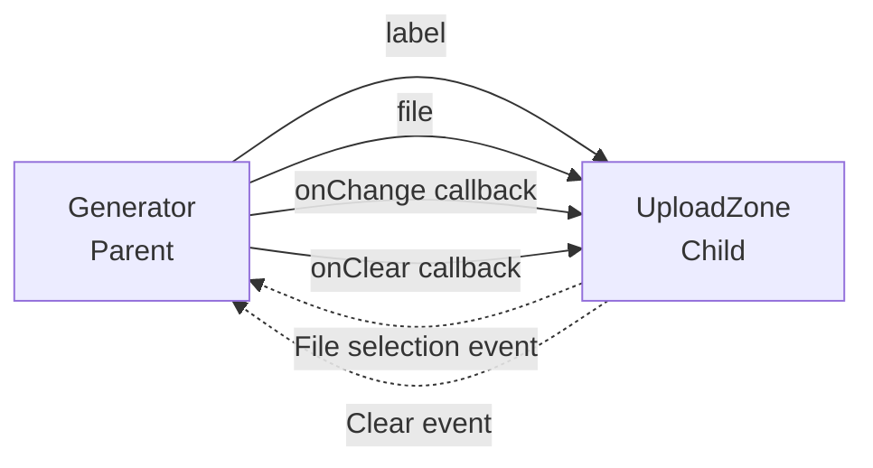

The parent owns the data.

The child displays the data and reports user interactions back through callbacks.

This means:

```text
Generator
   │
   │ owns
   ▼
productImage / modelImage
```

while:

```text
UploadZone
   │
   │ receives
   ▼
file prop
```

---

# 24. Why Keep Image State in Generator?

The `Generator` eventually needs all form values together:

```text
name
productName
productDescription
productImage
modelImage
aspectRatio
userPrompt
```

These values must eventually be submitted in one generation request.

Therefore keeping the state in the parent makes the submission straightforward.

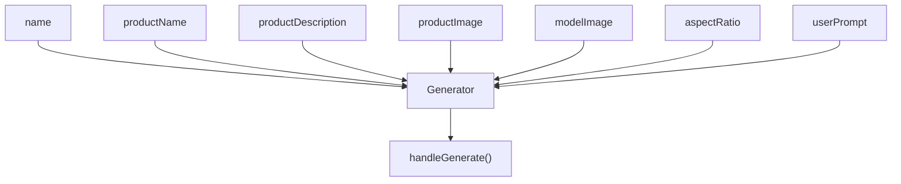

If every child maintained completely independent state, collecting all generation data during submission would become more complicated.

---

# 25. Conditional Rendering in UploadZone

The most important UI logic inside `UploadZone` is:

```tsx
{file ? (
  <>
    {/* Image Preview */}
  </>
) : (
  <>
    {/* Upload Interface */}
  </>
)}
```

The condition is simply:

```tsx
file
```

The UI therefore has two states:

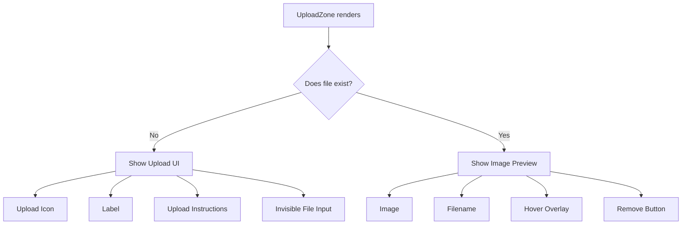

---

# 26. Empty Upload State

When:

```tsx
file === null
```

the following UI is displayed:

```tsx
<>
  <div className="
    w-16
    h-16
    rounded-full
    bg-white/5
    flex
    items-center
    justify-center
    mb-4
    group-hover:scale-110
    transition-transform
    duration-300
  ">
    <UploadIcon
      className="
        w-8
        h-8
        text-gray-400
        group-hover:text-violet-400
        transition-colors
      "
    />
  </div>

  <h3 className="text-lg font-semibold mb-2">
    {label}
  </h3>

  <p className="
    text-sm
    text-gray-400
    text-center
    max-w-[200px]
  ">
    Drag & drop or click to upload
  </p>

  <input
    type="file"
    accept="image/*"
    onChange={onChange}
    className="
      absolute
      inset-0
      w-full
      h-full
      opacity-0
      cursor-pointer
    "
  />
</>
```

The user sees a custom upload card while the actual browser file input remains invisible.

---

# 27. Invisible File Input Technique

The input uses:

```tsx
className="
  absolute
  inset-0
  w-full
  h-full
  opacity-0
  cursor-pointer
"
```

The important classes are:

```text
absolute
inset-0
w-full
h-full
opacity-0
```

The input covers the entire upload area but is invisible.

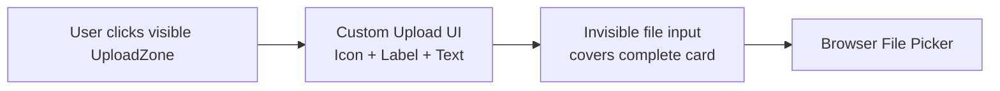

This allows us to combine:

```text
Native file-picker functionality
+
Custom application design
```

---

# 28. `accept="image/*"`

The file input contains:

```tsx
accept="image/*"
```

This tells the browser that this input is intended for image files.

Examples include:

```text
image/jpeg
image/png
image/webp
```

It improves the user experience when selecting files.

However, it should not be treated as backend security validation.

The backend/upload service should still validate files before storing or processing them.

---

# 29. Image Preview

When a file exists, the image is displayed using:

```tsx

```

The key part is:

```tsx
URL.createObjectURL(file)
```

---

# 30. `URL.createObjectURL()`

The selected image exists as a browser:

```tsx
File
```

But `` expects its `src` to contain a URL.

Therefore:

```tsx
URL.createObjectURL(file)
```

creates a temporary local browser URL.

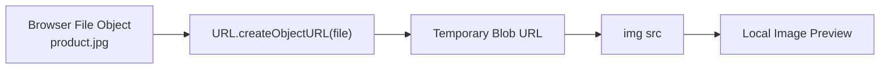

The important point is:

> The image does not need to be uploaded to the backend just to display a preview.

The preview is created locally inside the browser.

---

# 31. Object URL Cleanup

The current implementation uses:

```tsx
URL.createObjectURL(file)
```

directly during rendering.

This works, but every call creates a temporary object URL.

A more polished implementation should eventually release object URLs using:

```tsx
URL.revokeObjectURL(url);
```

This prevents unnecessary browser memory usage.

For the current project, the main concept is:

```text
File
 ↓
Object URL
 ↓
Preview
```

This can be optimized later without changing the overall upload architecture.

---

# 32. Image Preview Styling

The preview uses:

```tsx
object-cover
```

This means the image:

- Maintains its aspect ratio
- Fills the upload container
- May be cropped if necessary
- Is not stretched unnaturally

The preview also uses:

```tsx
opacity-60
```

which allows the overlay controls to remain clearly visible.

---

# 33. Image Remove Button

When an image exists, the component displays:

```tsx
<button
  type="button"
  onClick={onClear}
>
  <XIcon className="w-6 h-6" />
</button>
```

For the product uploader:

```tsx
onClear={() =>
  setProductImage(null)
}
```

For the model uploader:

```tsx
onClear={() =>
  setModelImage(null)
}
```

The clear flow is:

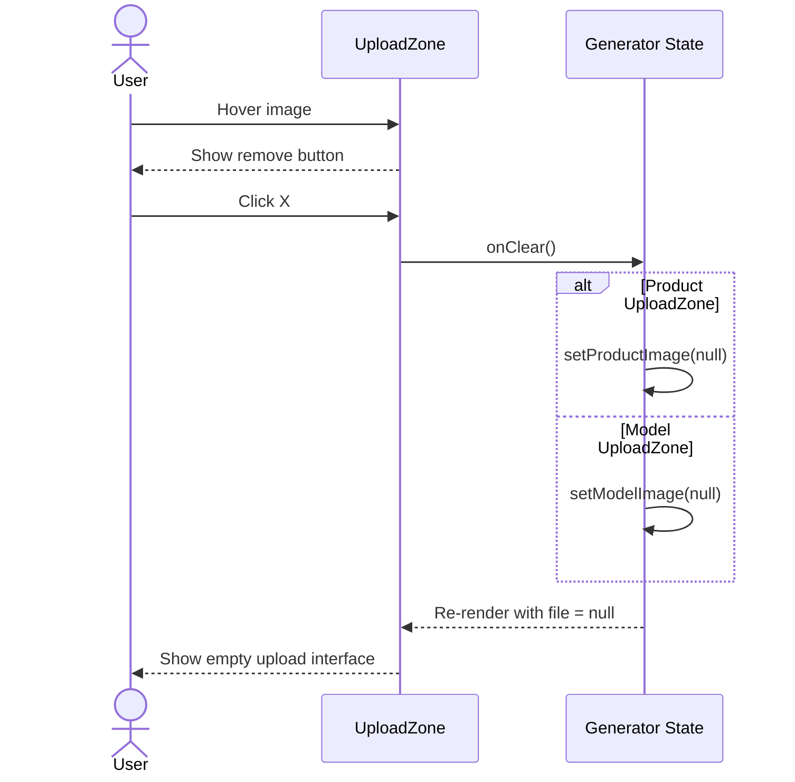

---

# 34. Why `type="button"` Matters

The remove button is located inside:

```tsx
<form>
```

Therefore we explicitly use:

```tsx
type="button"
```

Without this, a button inside a form may behave like a submit button.

That could accidentally trigger:

```tsx
handleGenerate()
```

when the user only intended to remove an image.

Therefore:

```tsx
<button type="button">
```

means:

> Perform this UI action without submitting the form.

---

# 35. Hover Overlay

The preview contains:

```tsx
<div className="
  absolute
  inset-0
  flex
  items-center
  justify-center
  opacity-0
  group-hover:opacity-100
  transition-opacity
  bg-black/40
  rounded-xl
  backdrop-blur-sm
">
```

The outer component contains:

```tsx
group
```

This allows child elements to use:

```tsx
group-hover:
```

Initially:

```tsx
opacity-0
```

When the upload card is hovered:

```tsx
group-hover:opacity-100
```

makes the overlay visible.

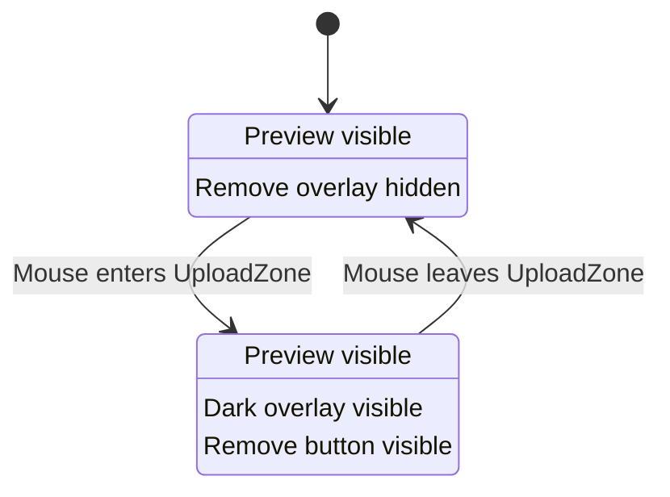

---

# 36. Displaying the Filename

The selected file name is displayed using:

```tsx
<p className="
  text-sm
  font-medium
  truncate
">
  {file.name}
</p>
```

For example:

```text
nova-smartwatch-product-image.png
```

`file.name` comes directly from the browser's `File` object.

The:

```tsx
truncate
```

class prevents long filenames from breaking the card layout.

---

# 37. Dynamic UploadZone Styling

The upload container changes appearance depending on whether a file exists.

```tsx
${file
  ? "border-violet-600/50 bg-violet-500/5"
  : "border-white/10 hover:border-violet-500/30 hover:bg-white/5"
}
```

Therefore:

### Empty

```text
border-white/10
hover:border-violet-500/30
hover:bg-white/5
```

### Image Selected

```text
border-violet-600/50
bg-violet-500/5
```

The selected state therefore gets a stronger violet visual indicator.

---

# 38. Form Submission

The entire generation interface is wrapped inside:

```tsx
<form
  onSubmit={handleGenerate}
  className="max-w-4xl mx-auto mb-40"
>
```

The submit handler is:

```tsx
const handleGenerate = async (
  e: React.FormEvent<HTMLFormElement>
) => {

  e.preventDefault();

};
```

---

# 39. Form Event Type

The event is typed:

```tsx
React.FormEvent<HTMLFormElement>
```

This tells TypeScript that:

```tsx
handleGenerate
```

handles the submission of an HTML form.

---

# 40. `e.preventDefault()`

A normal HTML form submission can cause browser navigation/page refresh.

Because this is a React SPA, we want JavaScript to control the generation request.

Therefore:

```tsx
e.preventDefault();
```

stops the browser's default form submission behaviour.

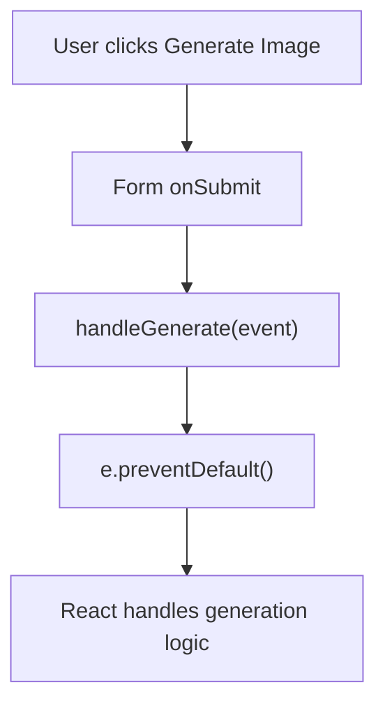

---

# 41. Generate Button

The page uses:

```tsx
<PrimaryButton
  disabled={isGenerating}
  className="
    px-10
    py-3
    rounded-md
    disabled:opacity-70
    disabled:cursor-not-allowed
  "
>
```

The button uses:

```tsx
isGenerating
```

to determine its state.

---

# 42. Generation Loading State

The component maintains:

```tsx
const [
  isGenerating,
  setIsGenerating
] = useState(false);
```

There are two possible states:

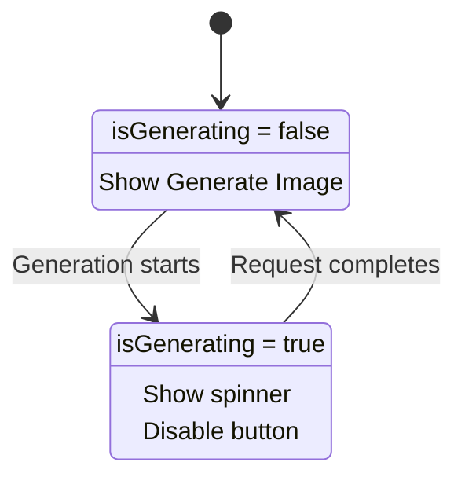

---

# 43. Conditional Button Content

The button uses:

```tsx
{isGenerating ? (
  <>
    <Loader2Icon
      className="size-5 animate-spin"
    />

    Generating...
  </>
) : (
  <>
    <Wand2Icon
      className="size-5"
    />

    Generate Image
  </>
)}
```

When:

```tsx
isGenerating === false
```

the user sees:

```text
✨ Generate Image
```

When:

```tsx
isGenerating === true
```

the user sees:

```text
⟳ Generating...
```

The spinner uses:

```tsx
animate-spin
```

to provide visual feedback.

---

# 44. Why the Generate Button Is Disabled

The button receives:

```tsx
disabled={isGenerating}
```

Therefore another generation cannot be triggered while the current one is running.

This becomes particularly important when real AI APIs are integrated.

Without this protection:

```text
User double-clicks Generate
          │
          ├── Request 1
          ├── Request 2
          └── Request 3
```

This could result in:

- Duplicate generations
- Multiple database records
- Multiple AI API calls
- Unnecessary billing/credit usage

With the disabled state:

```text
User clicks Generate
          │
          ▼
isGenerating = true
          │
          ▼
Button disabled
          │
          ▼
Generation completes
          │
          ▼
isGenerating = false
```

---

# 45. Complete Current Frontend Data Flow

The current `Generator` page can be summarized as:

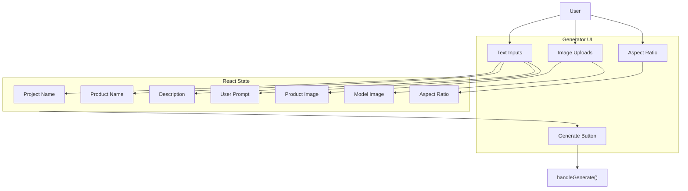

At this stage:

```tsx
handleGenerate()
```

only prevents the default form submission.

The actual backend call will be added later.

---

# 46. Data Required for a Generation

Based on the current frontend, a generation contains information similar to:

```text
Project Name:
Summer Smartwatch Campaign

Product Name:
Nova Smart Watch

Product Description:
Premium smartwatch with AMOLED display,
GPS and health tracking.

Product Image:
nova-watch.png

Model Image:
creator.png

Aspect Ratio:
9:16

User Prompt:
Create a casual, energetic UGC-style ad.
```

Conceptually:

```mermaid
flowchart TD
    N["Project Name"]
    PN["Product Name"]
    PD["Product Description"]
    PI["Product Image"]
    MI["Model Image"]
    AR["Aspect Ratio"]
    UP["User Prompt"]

    N --> REQ["Generation Request"]
    PN --> REQ
    PD --> REQ
    PI --> REQ
    MI --> REQ
    AR --> REQ
    UP --> REQ

    REQ --> BACKEND["Backend<br/>To Be Implemented"]
```

---

# 47. Why Files Cannot Simply Be Treated Like Normal JSON

Text fields can easily be represented as JSON:

```json
{
  "name": "Summer Campaign",
  "productName": "Nova Watch",
  "aspectRatio": "9:16"
}
```

But:

```tsx
productImage
```

and:

```tsx
modelImage
```

are actual browser `File` objects.

Therefore, when we connect this page to the backend, we may need a file-capable request format such as:

```tsx
FormData
```

Example:

```tsx
const formData = new FormData();

formData.append(
  "name",
  name
);

formData.append(
  "productName",
  productName
);

formData.append(
  "productDescription",
  productDescription
);

formData.append(
  "aspectRatio",
  aspectRatio
);

formData.append(
  "userPrompt",
  userPrompt
);

if (productImage) {
  formData.append(
    "productImage",
    productImage
  );
}

if (modelImage) {
  formData.append(
    "modelImage",
    modelImage
  );
}
```

This is not part of the current implementation yet.

The final upload approach should be documented once the backend and cloud-storage flow are implemented.

---

# 48. Future Backend Generation Flow

Once the backend is connected, the expected high-level flow will become:

```mermaid
sequenceDiagram
    actor User
    participant G as Generator
    participant API as Backend API
    participant Storage as Image Storage
    participant AI as AI Service
    participant DB as Database
    participant Result as Result Page

    User->>G: Fill generation form
    User->>G: Upload product/model images
    User->>G: Click Generate Image

    G->>G: Validate form
    G->>G: setIsGenerating(true)

    G->>API: Send generation request

    API->>Storage: Upload/process images
    Storage-->>API: Image URLs

    API->>AI: Send product context + images + prompt
    AI-->>API: Generated result

    API->>DB: Save project/generation
    DB-->>API: Saved project

    API-->>G: Return generation result

    G->>G: setIsGenerating(false)
    G->>Result: Navigate to result
```

The exact flow may change depending on the backend implementation and AI services used.

---

# 49. Important TypeScript Used in This Component

The most important TypeScript types are:

## File State

```tsx
File | null
```

Used because an image can either exist or not exist.

---

## File Input Event

```tsx
React.ChangeEvent<HTMLInputElement>
```

Used for:

```tsx
<input type="file" />
```

---

## Form Event

```tsx
React.FormEvent<HTMLFormElement>
```

Used for:

```tsx
<form onSubmit={handleGenerate}>
```

---

## Image Type Union

```tsx
"product" | "model"
```

Restricts the file handler to the supported image categories.

---

## UploadZone Props

```tsx
export interface UploadZoneProps {
  label: string;

  file: File | null;

  onClear: () => void;

  onChange: (
    e: React.ChangeEvent<HTMLInputElement>
  ) => void;
}
```

---

# 50. Important Implementation Decisions

The main design decisions in these components are:

### 1. Generator owns all form state

```text
Generator
└── State
```

This makes it easy to collect everything during submission.

---

### 2. UploadZone is reusable

Instead of duplicating image-upload UI:

```tsx
<UploadZone ... />
<UploadZone ... />
```

is reused for both images.

---

### 3. Files are stored as `File` objects

```tsx
File | null
```

This allows the actual image data to later be uploaded to the backend.

---

### 4. Local previews do not require server uploads

```tsx
URL.createObjectURL(file)
```

creates the preview directly in the browser.

---

### 5. TypeScript restricts file categories

```tsx
"product" | "model"
```

prevents unsupported values.

---

### 6. Generation has an explicit loading state

```tsx
isGenerating
```

allows the UI to prevent duplicate requests and show progress.

---

# 51. Quick Revision

### Main Generator State

```tsx
const [name, setName] = useState("");

const [productName, setProductName] =
  useState("");

const [
  productDescription,
  setProductDescription
] = useState("");

const [aspectRatio, setAspectRatio] =
  useState("9:16");

const [productImage, setProductImage] =
  useState<File | null>(null);

const [modelImage, setModelImage] =
  useState<File | null>(null);

const [userPrompt, setUserPrompt] =
  useState("");

const [isGenerating, setIsGenerating] =
  useState(false);
```

### File Handler

```tsx
const handleFileChange = (
  e: React.ChangeEvent<HTMLInputElement>,
  type: "product" | "model"
) => {

  if (
    e.target.files &&
    e.target.files[0]
  ) {

    if (type === "product")
      setProductImage(e.target.files[0]);

    else
      setModelImage(e.target.files[0]);
  }
};
```

### Product Upload

```tsx
<UploadZone
  label="Product Image"
  file={productImage}
  onClear={() =>
    setProductImage(null)
  }
  onChange={(e) =>
    handleFileChange(e, "product")
  }
/>
```

### Model Upload

```tsx
<UploadZone
  label="Model Image"
  file={modelImage}
  onClear={() =>
    setModelImage(null)
  }
  onChange={(e) =>
    handleFileChange(e, "model")
  }
/>
```

### Conditional Upload UI

```tsx
{file ? (
  // Preview
) : (
  // Upload interface
)}
```

### Local Preview

```tsx
URL.createObjectURL(file)
```

### Form Handler

```tsx
const handleGenerate = async (
  e: React.FormEvent<HTMLFormElement>
) => {

  e.preventDefault();

};
```

### Generation Button

```tsx
<PrimaryButton
  disabled={isGenerating}
>
  {isGenerating ? (
    <>
      <Loader2Icon
        className="animate-spin"
      />

      Generating...
    </>
  ) : (
    <>
      <Wand2Icon />

      Generate Image
    </>
  )}
</PrimaryButton>
```

---

# 52. Final Component Flow

The complete frontend implementation can be remembered through this diagram:

```mermaid
flowchart TD
    USER["User"]

    USER --> FORM["Generator Form"]

    FORM --> TEXT["Enter Product Information"]
    FORM --> IMAGES["Upload Images"]
    FORM --> RATIO["Choose Aspect Ratio"]
    FORM --> PROMPT["Add Optional Prompt"]

    IMAGES --> UZ["Reusable UploadZone"]

    UZ --> FILE["Browser File Object"]
    FILE --> PREVIEW["Local Image Preview"]

    TEXT --> STATE["Generator React State"]
    FILE --> STATE
    RATIO --> STATE
    PROMPT --> STATE

    STATE --> GENERATE["Generate Image"]

    GENERATE --> HG["handleGenerate()"]

    HG --> API["Backend API<br/>Next Stage"]

    API --> AI["AI Generation<br/>Next Stage"]

    AI --> RESULT["Generated UGC Result"]
```

The `Generator` therefore acts as the **main controller of generation-form state**, while `UploadZone` is a **reusable presentation and interaction component for image selection**.

When the backend is implemented, `handleGenerate()` will become the bridge between this frontend state and the actual AI generation pipeline.